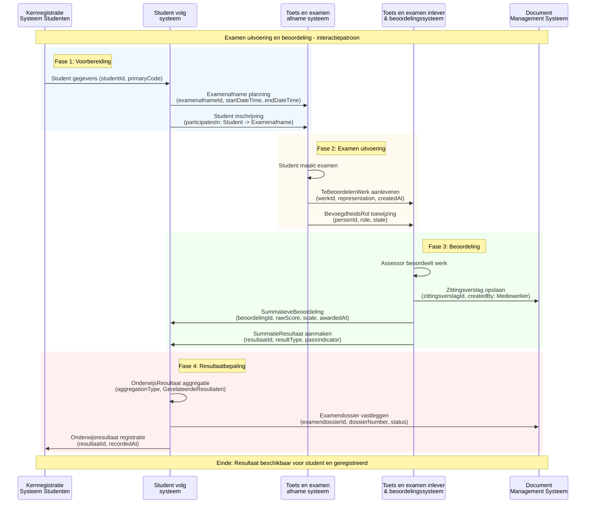

<!-- ===================== -->
<!-- Titelpagina -->
<!-- ===================== -->
# MOKA Koppelvlak Specificatie Document - DEMO

## Examen uitvoering en beoordeling

**Versie:** v20260204  
**Datum:** 2026-02-04  
**Status:** Concept  
**Auteur:** Niek Derksen
**Organisatie:** MOKA Werkgroep

---

### Documentdoel

Dit document beschrijft de MOKA koppelvlak specificatie voor een deelgebied van de MORA procesketen Examineren.  
Het document is bedoeld om sectorbreed afspraken vast te leggen over betekenis, structuur en interactie van informatieobjecten, in samenhang met MORA, dienend als referentiepunt voor koppelvlak implementaties, zoals OKE.
In eerste instantie bedoeld ter demo voor de MOKA werkgroep te 05-02-26.

---

<!-- ===================== -->
<!-- Versiehistorie -->
<!-- ===================== -->

## Versiehistorie

| Versie | Datum       | Auteur        | Wijziging |
|------:|------------|---------------|-----------|
| v20260204  | 2026-02-04| Niek Derksen  | Initiële versie van deze koppelvlak specificatie t.b.h.v. MOKA werkgroep Demo i.h.k.v. Klus 43 voortgangsupdate |

---

<!-- ===================== -->
<!-- Inhoudsopgave -->
<!-- ===================== -->

## Inhoudsopgave

- [MOKA Koppelvlak Specificatie Document - DEMO](#moka-koppelvlak-specificatie-document---demo)
  - [Examen uitvoering en beoordeling](#examen-uitvoering-en-beoordeling)
    - [Documentdoel](#documentdoel)
  - [Versiehistorie](#versiehistorie)
  - [Inhoudsopgave](#inhoudsopgave)
  - [1. Inleiding](#1-inleiding)
  - [2. Leeswijzer](#2-leeswijzer)
  - [3. MOKA Koppelvlak Specificatie](#3-moka-koppelvlak-specificatie)
    - [3.1 MORA Procesplaatsing](#31-mora-procesplaatsing)
    - [3.2 MOKA Koppelvlak Specificatie Viewpoint](#32-moka-koppelvlak-specificatie-viewpoint)
      - [3.2.1 Metamodel](#321-metamodel)
      - [3.2.2 MOKA Koppelvlak Specificatie View](#322-moka-koppelvlak-specificatie-view)
      - [3.2.3 MOKA Koppelvlak specifiek informatiemodel view](#323-moka-koppelvlak-specifiek-informatiemodel-view)
      - [3.2.4 MOKA Koppelvlak specifiek referentie objectdiagram view](#324-moka-koppelvlak-specifiek-referentie-objectdiagram-view)
      - [3.2.5 MOKA Koppelvlak interactiepatroon view](#325-moka-koppelvlak-interactiepatroon-view)
  - [3.2.6 Gerelateerde Implementaties en Specificaties](#326-gerelateerde-implementaties-en-specificaties)

---

<!-- ===================== -->
<!-- Hoofdstuk 1: Inleiding -->
<!-- ===================== -->

## 1. Inleiding

*[Tekst volgt]*

---

<!-- ===================== -->
<!-- Hoofdstuk 2: Leeswijzer -->
<!-- ===================== -->

## 2. Leeswijzer

*[Tekst volgt]*

---

<!-- ===================== -->
<!-- Hoofdstuk 3: MOKA Koppelvlak Specificatie -->
<!-- ===================== -->

## 3. MOKA Koppelvlak Specificatie

*[Inleidende tekst volgt]*

---

### 3.1 MORA Procesplaatsing

*[Tekst volgt]*

**Figuur 3.1:** Procesketengebied indicatie binnen MORA hoofdprocesmodel

---

### 3.2 MOKA Koppelvlak Specificatie Viewpoint

*[Tekst volgt]*

---

#### 3.2.1 Metamodel

*[Tekst volgt]*

**Figuur 3.2.1:** MORA en MOKA metamodel met toelichting

---

#### 3.2.2 MOKA Koppelvlak Specificatie View

*[Tekst volgt]*

**Figuur 3.2.2:** MOKA koppelvlak specificatie view

---

#### 3.2.3 MOKA Koppelvlak specifiek informatiemodel view

*[Tekst volgt]*

**Figuur 3.2.3:** Koppelvlak specifiek informatiemodel view

---

#### 3.2.4 MOKA Koppelvlak specifiek referentie objectdiagram view

*[Tekst volgt]*

**Figuur 3.2.4:** MOKA koppelvlak specifiek object diagram

---

#### 3.2.5 MOKA Koppelvlak interactiepatroon view

Het onderstaande interactiepatroon toont de gegevensuitwisseling tussen de MORA referentiecomponenten binnen de examen uitvoerings- en beoordelingsketen.

**Referentiecomponenten in scope:**
- Toets en examen afname systeem
- Toets en examen inlever & beoordelingssysteem  
- Student volg systeem (SVS)
- Document Management Systeem (DMS)
- Kernregistratie Systeem Studenten (KRS)

**Figuur 3.2.5:** Interactiepatroon tussen MORA referentiecomponenten (gebaseerd op OOAPI objectmodel)

---

## 3.2.6 Gerelateerde Implementaties en Specificaties

Voor meer informatie omtrent het koppelvlakprofiel en gerelateerde implementaties:

- Raadpleeg het [OOAPI OKE profiel (specificatie v5)](https://github.com/NetwerkExamineringDigitalisering/NED-OOAPI/tree/main/specification/v5) voor de technische uitwerking.
- Raadpleeg het [OKE MBO Toetsafname Specificatie Document (conceptversie 1.0, 9 september 2024, PDF)](https://www.edustandaard.nl/app/uploads/2024/09/OKE-MBO-toetsafname-specs-v1.0_20240909conceptversie.pdf), specifiek de paragrafen **3.3** ("Globale gegevensuitwisselingen tussen systemen") en **3.4** ("Koppelvlak-definitie").

Deze documenten bevatten de actuele technische specificaties en koppelvlakeisen voor de OKE-keten.

<!-- ===================== -->
<!-- Einde document -->
<!-- ===================== -->
