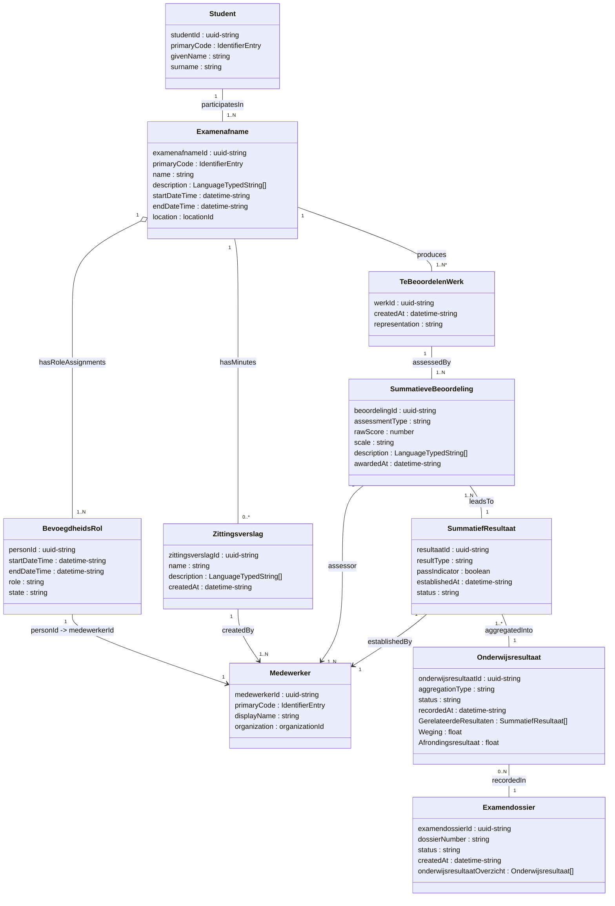
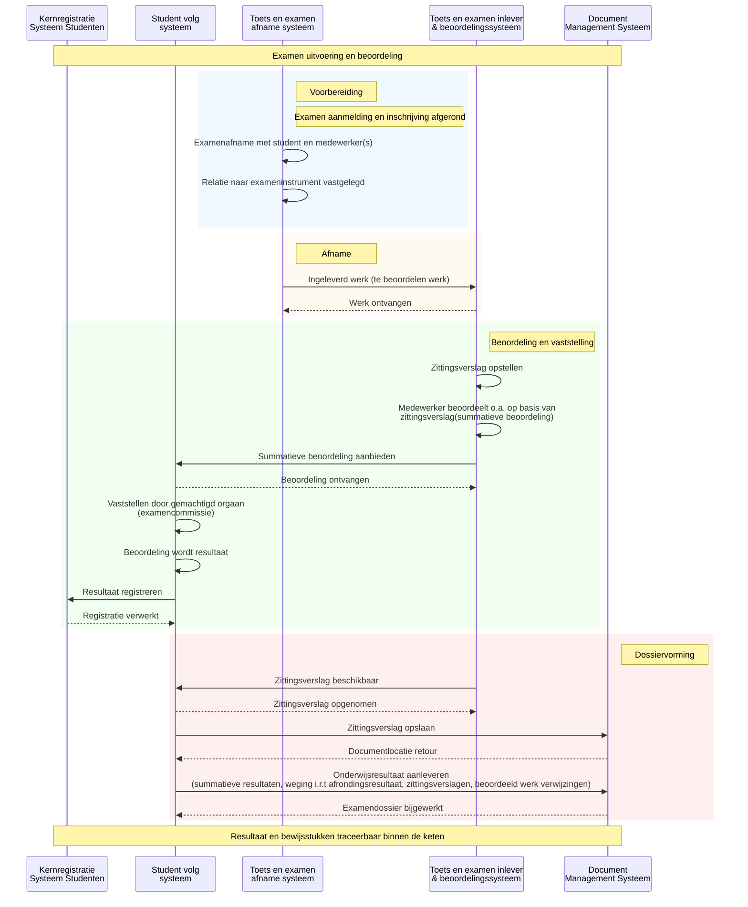

<!-- ===================== -->
<!-- Titelpagina -->
<!-- ===================== -->
# MOKA Koppelvlak Specificatie Document - DEMO

## Examen uitvoering en beoordeling

**Versie:** v20260204  
**Datum:** 2026-02-04  
**Status:** Concept  
**Auteur:** Niek Derksen
**Organisatie:** MOKA Werkgroep

---

### Documentdoel

Dit document beschrijft de MOKA koppelvlak specificatie voor een deelgebied van de MORA procesketen Examineren.  
Het document is bedoeld om sectorbreed afspraken vast te leggen over betekenis, structuur en interactie van informatieobjecten, in samenhang met MORA, dienend als referentiepunt voor koppelvlak implementaties.
In eerste instantie bedoeld ter demo voor de MOKA werkgroep te 05-02-26.

---

<!-- ===================== -->
<!-- Versiehistorie -->
<!-- ===================== -->

## Versiehistorie

| Versie | Datum       | Auteur        | Wijziging |
|------:|------------|---------------|-----------|
| v20260204  | 2026-02-04| Niek Derksen  | Initiële versie van deze koppelvlak specificatie t.b.h.v. MOKA werkgroep Demo i.h.k.v. Klus 43 voortgangsupdate |

---

<!-- ===================== -->
<!-- Inhoudsopgave -->
<!-- ===================== -->

## Inhoudsopgave

- [MOKA Koppelvlak Specificatie Document - DEMO](#moka-koppelvlak-specificatie-document---demo)
  - [Examen uitvoering en beoordeling](#examen-uitvoering-en-beoordeling)
    - [Documentdoel](#documentdoel)
  - [Versiehistorie](#versiehistorie)
  - [Inhoudsopgave](#inhoudsopgave)
  - [1. Inleiding](#1-inleiding)
  - [3. MOKA Koppelvlak Specificatie](#3-moka-koppelvlak-specificatie)
    - [3.1 MORA Procesplaatsing](#31-mora-procesplaatsing)
    - [3.2 MOKA Koppelvlak Specificatie Viewpoint](#32-moka-koppelvlak-specificatie-viewpoint)
      - [3.2.1 Metamodel](#321-metamodel)
      - [3.2.2 MOKA Koppelvlak Specificatie View](#322-moka-koppelvlak-specificatie-view)
      - [3.2.3 MOKA Koppelvlak specifiek informatiemodel view](#323-moka-koppelvlak-specifiek-informatiemodel-view)
      - [3.2.4 MOKA Koppelvlak specifiek referentie objectdiagram view](#324-moka-koppelvlak-specifiek-referentie-objectdiagram-view)
      - [3.2.5 MOKA Koppelvlak interactiepatroon view](#325-moka-koppelvlak-interactiepatroon-view)
  - [3.2.6 Gerelateerde Implementaties en Specificaties](#326-gerelateerde-implementaties-en-specificaties)

---

<!-- ===================== -->
<!-- Hoofdstuk 1: Inleiding -->
<!-- ===================== -->

## 1. Inleiding

Deze sectie beschrijft het koppelvlak-viewpoint voor de referentiearchitectuur van het MOKA deelgebied Examen uitvoering en beoordeling.
Het doel is om gegevensuitwisseling en verantwoordelijkheden tussen referentiecomponenten eenduidig te positioneren, zodat implementaties hierop terug te leiden zijn.

---

<!-- ===================== -->
<!-- Hoofdstuk 3: MOKA Koppelvlak Specificatie -->
<!-- ===================== -->

## 3. MOKA Koppelvlak Specificatie

In dit hoofdstuk staan de samenhang tussen procesplaatsing, metamodel en concrete views centraal.
De figuren worden gebruikt om het referentiekader van het koppelvlak vast te leggen en bespreekbaar te maken.

---

### 3.1 MORA Procesplaatsing

De procesplaatsing positioneert het deelgebied binnen de MORA-keten Examineren en diplomeren.
Deze plaatsing bepaalt welke processtappen en informatieobjecten in scope zijn voor het koppelvlak.

**Figuur 3.1:** Procesketengebied indicatie binnen MORA hoofdprocesmodel
**Viewpoint:** Procesplaatsing (ArchiMate Business Process view)  
**Legenda:** Business Process, Grouping

---

### 3.2 MOKA Koppelvlak Specificatie Viewpoint

Het viewpoint beschrijft hoe processen, informatieobjecten en referentiecomponenten samenkomen in de koppelvlakdefinitie.
Hiermee ontstaat een gedeeld referentiekader voor ontwerp en afstemming.

**Viewpoint-beschrijving (kort):** het doel, de concerns, de scope, de gebruikte modeltaal en de relevante objecttypen/relaties van de view.
De keuzes volgen de AMIGO modellenmatrix: conceptuele views (ArchiMate), logische/inrichtingsmodellen (UML/ERD) en interacties (Mermaid) richting berichtspecificatie.

Voor de MOKA metamodelering hanteren we een expliciete ontkoppeling tussen conceptuele en logische modellen.
In ArchiMate modelleren we maximaal twee lagen diep in dataobjecten (conceptueel), zodat scope en semantiek helder blijven.
Verdieping van structuur en relaties vindt plaats in UML/ERD en sequentiediagrammen, wat zorgt voor precisie zonder het conceptuele model te belasten.

**Figuur 3.2.0a:** AMIGO modellenmatrix (bronafbeelding)  
**Viewpoint:** Modellenmatrix (AMIGO niveaus van modellen en modeltalen)  
**Legenda:** Conceptueel, Logisch, Technisch; inhoudslijn van onderwijsbreed naar inrichting.

| MOKA view | AMIGO kolom | AMIGO rij | Toelichting |
|---|---|---|---|
| MOKA koppelvlak specificatie view | Toepassingsgebied | Conceptuele modellen (ketenprocesmodel/-scenario) | Brug tussen conceptuele ketenlogica en scope van het koppelvlak. |
| MOKA informatiemodel view | Toepassingsgebied | Conceptuele modellen (informatiemodel) | Conceptuele informatieobjecten en relaties binnen het toepassingsgebied. |
| MOKA referentie klassendiagram | Inrichting | Logische modellen (inrichtingsgegevensmodel) | UML/ERD detaillering van gegevensstructuur en attributen. |
| MOKA interactiepatroon view | Inrichting | Logische modellen (interactiespecificatie) | Logische interacties tussen componenten als basis voor berichtspecificatie. |

**Figuur 3.2.0:** AMIGO modellenmatrix (mappingtabel)  
**Referentie:** AMIGO-methodiek v1.1.0 - https://www.edustandaard.nl/app/uploads/2025/10/AMIGO-methodiek-1.1.0-1.pdf  

---

#### 3.2.1 Metamodel

Het metamodel legt de basisrelaties vast tussen de kernobjecten en hun context in MORA en MOKA.
Dit voorkomt interpretatieverschillen bij het gebruik van het koppelvlak.

**Figuur 3.2.1:** MORA en MOKA metamodel met toelichting
**Viewpoint:** Conceptueel metamodel (ArchiMate concept view)  
**Legenda:** Business Object, Data Object, Application Component, Association, Realization

---

#### 3.2.2 MOKA Koppelvlak Specificatie View

Deze view visualiseert de keten en de belangrijkste informatieobjecten binnen het koppelvlakgebied.
Het geeft inzicht in de hoofdstructuur van de uitwisseling.

**Figuur 3.2.2:** MOKA koppelvlak specificatie view
**Viewpoint:** Koppelvlak view (ArchiMate Application Cooperation view)  
**Legenda:** Application Component, Application Service, Data Object, Flow, Access. Rode BusinessObjects of relaties, referen aan momenteel niet bestaande MORA InformatieObjecten.
**Positionering:** Deze view ligt op het snijvlak van conceptueel en logisch en vormt de brug tussen ArchiMate en de detailmodellen.

---

#### 3.2.3 MOKA Koppelvlak specifiek informatiemodel view

Het informatiemodel beschrijft de kernobjecten en hun relaties die relevant zijn voor het koppelvlak.
Dit is de basis voor semantische eenduidigheid in implementaties.

**Figuur 3.2.3:** Koppelvlak specifiek informatiemodel view
**Viewpoint:** Informatiemodel (ArchiMate Information Structure view)  
**Legenda:** Business Object, Data Object, Association, Composition. Rode BusinessObjects of relaties, referen aan momenteel niet bestaande MORA InformatieObjecten.

---

#### 3.2.4 MOKA Koppelvlak specifiek referentie objectdiagram view

Het referentie objectdiagram concretiseert de informatieobjecten in een eenduidige objectrepresentatie.
Hiermee kan de mapping naar implementaties expliciet worden gemaakt.

---

#### 3.2.5 MOKA Koppelvlak interactiepatroon view

Het onderstaande interactiepatroon is gebaseerd op de informatieobjecten uit het informatiemodel en het referentie objectdiagram.
Het diagram is implementatie-onafhankelijk en positioneert de uitwisseling tussen de referentiecomponenten.

**Referentiecomponenten in scope:**
- Toets en examen afname systeem
- Toets en examen inlever & beoordelingssysteem  
- Student volg systeem (SVS)
- Document Management Systeem (DMS)
- Kernregistratie Systeem Studenten (KRS)

**Figuur 3.2.5:** Interactiepatroon tussen referentiecomponenten en informatieobjecten
**Viewpoint:** Interactiepatroon (ArchiMate Application Process/Flow view)  
**Legenda:** Application Component, Flow, Data Object, Triggering

---

## 3.2.6 Gerelateerde Implementaties en Specificaties

Voor meer informatie omtrent het koppelvlakprofiel en gerelateerde implementaties:

- Raadpleeg het [externe API-profiel (specificatie v5)](https://github.com/NetwerkExamineringDigitalisering/NED-OOAPI/tree/main/specification/v5) voor de technische uitwerking.
- Raadpleeg het [externe koppelvlakspecificatiedocument (conceptversie 1.0, 9 september 2024, PDF)](https://www.edustandaard.nl/app/uploads/2024/09/OKE-MBO-toetsafname-specs-v1.0_20240909conceptversie.pdf) voor informatiestromen en uitwisselingen.

Deze documenten bevatten de actuele technische specificaties en koppelvlakeisen voor externe implementaties.

<!-- ===================== -->
<!-- Einde document -->
<!-- ===================== -->
